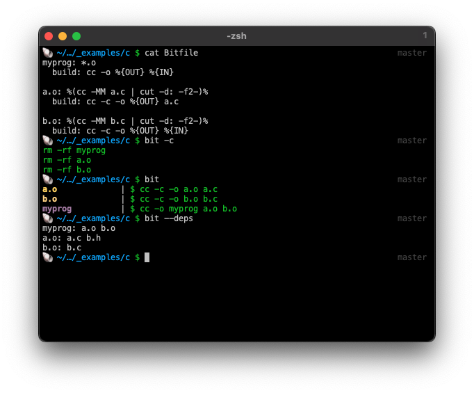

# Bit - A simple yet powerful build tool [](https://github.com/alecthomas/bit/actions/workflows/ci.yml)



Bit's goal is to be a simple yet powerful local build system. It is inspired
by [Make](https://www.gnu.org/software/make/manual/make.html), with the
following goals:

- Simple declarative file format.
- Leverage existing Unix knowledge.
- Deterministic, incremental, parallel builds.
- As "type safe" as possible while maintaining usability.
- Ability to build virtual targets (e.g. Docker images, Kubernetes resources, etc.).
- Great error messages.

Non-goals:

- No need to learn a new Turing complete build language and
  associated libraries (e.g. Bazel, Gradle, etc.).

Bit is driven by a configuration file called a `Bitfile`. It is described below.

## Development status

What's implemented so far:

- [x] [Variable expansion](#variables)
- [x] [Command substitution](#command-substitution)
- [x] Output verification
- [x] [Dependencies](#dependencies)
- [x] Hashing
- [x] [Concrete targets](#targets)
- [ ] [Implicit targets](#implicit-targets)
- [ ] [Virtual targets](#virtual-targets)
- [ ] [Templates](#templates)
- [ ] [Inheritance](#inheritance)
- [ ] Directives
  - [x] [Build](#create-directive-optional)
  - [x] [Inputs](#inputs-directive-optional)
  - [x] [Outputs](#outputs-directive-optional)
  - [x] [Hash](#hash-directive-optional)
  - [x] [Clean](#clean-directive-optional)

## Motivation

While I love the simplicity of `make`, it has some pretty big limitations:

- If a target fails to build an output, it will still succeed, and the 
  target will silently continue to be out-of-date.
- Similarly, with variable interpolation, if a variable is undefined it will
  silently be interpolated as an empty string.
- Make can't (natively) capture non-filesystem dependencies. For example, if a
  target depends on a Docker image, it can't be expressed without intermediate
  files being manually created to track this.

## Bitfile

The Bitfile is a declarative file that describes how to build targets. It consists
of targets, templates, and variables, that can be substituted into targets.

### Glob expansion

Glob expansion is supported in inputs, but not outputs. This is because
globs operate on the filesystem and outputs may not be present at time of 
expansion. Bit will report an error for globs in outputs.

### Variables

Variables are in the form:

```
[export] var = value
```

Or:

```
var =
  value
  value
```

If a variable is prefixed with `export` it will be made available to child
processes as environment variables.

eg.

```
export GRADLE_OPTS = -Dorg.gradle.console=plain
```

They can be set on the command line, at the top level of a `Bitfile`,
or in a target. Variables are interpolated with the syntax `%{var}`. Interpolation 
occurs after inheritance and before any other evaluation.

### Command substitution

Command substitution is in the form:

```
%(command)%
```

### Targets

Targets are in the form:

```
output1 output2 ...: input1 input2 ...
  < other-target                            # Inherit from a target
  < template(arg1=value, arg2=value, ...)   # Inherit from a template
  cd dir                                    # Change directory
  var = value                               # Set variable
  -var                                      # Delete variable
  var += value                              # Append to variable
  var ^= value                              # Prepend to variable
  directive: parameters                     # Replace inherited directive
  -directive                                # Delete inherited directive
  +directive: parameters                    # Append to inherited directive
  ^directive: parameters                    # Prepend to inherited directive
```

eg.


```
kotlin-runtime/ftl-runtime/build/libs/ftl-runtime.jar: \
      kotlin-runtime/ftl-runtime/**/*.{kt,kts} \
      kotlin-runtime/gradle/libs.versions.toml \
      **/*.proto **/buf.* \
      protos/xyz/block/ftl/v1/schema/schema.proto
  build: cd kotlin-runtime/ftl-runtime && gradle jar
  +clean: cd kotlin-runtime/ftl-runtime && gradle clean
```


### Implicit targets

Implicit targets are patterns that result in concrete targets for any matching
files. They take the form:

```
implicit <replace>: <pattern>
```

Where any text matching `@` is extracted from `<pattern>` and interpolated 
into `<replace>`.

eg.

```
implicit @.o: @.c
  inputs: %(cc -MM %{IN} | cut -d: -f2-)%
  build: cc -c %{IN} -o %{OUT}
```

Given the file `input.c`, the previous `implicit` will result in the
following concrete target:

```
input.o: input.c
  inputs: input.c header.h
  build: cc -c input.c -o input.o
```

### Virtual targets

Virtual targets do not exist in the filesystem, but instead refer to some virtual resource.
Examples might include Docker images, Kubernetes resources, an object in S3, etc.

They must be `hash`able and include the `create` directive.

Virtual targets have the syntax:

```
virtual name: [dependency1 dependency2 ...]
  hash: ...
  create: ...
  ...
```

Here's an example of a `Bitfile` that represents a Docker image and 
the running container built from it, rebuilding/restarting both when the
Dockerfile or any of the files in the current directory change:

```
virtual docker-container: docker-image
  hash: docker inspect docker-container
  create: docker run --restart=always -d docker-image
  clean: docker rm -f docker-container
  
virtual docker-image: Dockerfile ./**
  hash: docker image inspect docker-image
  create: docker build -f Dockerfile -t docker-image .
  clean: docker rmi docker-image
```

### Templates

Templates are targets that can be inherited from. They are in the form:

```
[virtual] template name(arg1, arg2, ...) [input1 input2 ...]: [dependency1 dependency2 ...]
  ...
```

Arguments are interpolated into the directives using the syntax `%{arg1}`, in order
to differentiate them from shell variable interpolation.

When calling a template, arguments are always named. Templates can be invoked
directly from the command line by providing arguments in the form
`name:arg1=value,arg2=value,...`.

In addition to being inheritable, templates can also be used as direct dependencies:

```
target: template(arg1=value, arg2=value, ...)
  ...
```

### Dependencies

Dependencies are targets that must be built before the current target. They may be either
virtual targets or files on the local filesystem. For files, globs may be used.

### Inheritance

Targets can inherit from other targets or templates with the `<` operator:

```
target: dependency
  < other-target                            # Inherit from a target
  < template(arg1=value, arg2=value, ...)   # Inherit from a template
```

When inheriting, existing directives can be replaced, deleted, appended or prepended to 
using the syntax:

```
directive: parameters                     # Replace inherited directive
-directive                                # Delete inherited directive
+directive: parameters                    # Append to inherited directive
^directive: parameters                    # Prepend to inherited directive
```

Similarly, variables can be set, deleted, appended, or prepended to using the syntax:

```
var = value                               # Set variable
-var                                      # Delete variable
var += value                              # Append to variable
var ^= value                              # Prepend to variable
```

### Implicit default target

An implicit default target exists for files and directories on the
local filesystem. For files, the content of the file is used as the hash.
For directories, the content of every file in the directory is used
(non recursively).

eg. for files

```
%{file}:
  hash: cat %{file}
```

And for directories:

```
%{dir}: %{dir}/**
```

This is primarily useful as a dependency of another target.

eg. given

```
file.o: file.c file.h
  create: gcc -c file.c -o file.o
```

The expansion is:

```
file.o: file.c file.h
  create: gcc -c file.c -o file.o
  
file.c:
  hash: cat file.c
  
file.h:
  hash: cat file.h
```

### Directives

Directives are in the form:

```
directive: parameters
```

A newline followed by an indent indicates a multi-line directive. In
this case all leading whitespace is stripped.

```
directive:
  parameter
  parameter
```

Available directives are:
#### `cd` directive (optional)

The `cd` directive changes the working directory for the target.

```
cd directory
```

#### `hash` directive (optional)

The `hash` directive runs a command, hashes its output along with any dependencies, 
and stores it in the Bit database as the current state of the target. If the command
fails the target is assumed to be out-of-date. When building, the hash is recomputed
and compared with the existing state. If it has changed the target is rebuilt and
the new hash stored.

If omitted, the output is hashed.

```
hash: command
```

#### `build` directive (optional)

The `build` directive runs a command if the target is not up-to-date.

If the `build` directive is omitted and the target is not up-to-date, the build
will fail.

```
build: command
```

#### `clean` directive (optional)

The `clean` directive runs a command to delete the target.

```
clean: command
```

It is optional and if omitted, the target is not deleted when cleaning.

#### `inputs` directive (optional)

In addition to defining inputs on the target definition directly,
inputs may be defined in an inputs directive.

This may be on a single line, or indented and on multiple lines.

#### `outputs` directive (optional)

In addition to defining outputs on the target definition directly,
outputs may be defined in an outputs directive.

This may be on a single line, or indented and on multiple lines.

### Example

```
dest = ./build
version = %(git describe --tags --always)

virtual k8s-postgres:
  < k8s-apply(manifest="deployment/db.yml", resource="pod/ftl-pg-cluster-1-0"):

virtual k8s-ftl-controller: k8s-postgres
  < k8s-apply(manifest="deployment/ftl-controller.yml", resource="deployment/ftl-controller")

virtual release: %{dest}/ftl %{dest}/ftl-controller %{dest}/ftl-runner \
    docker-ftl-runner docker-ftl-controller

%{dest}/ftl:
  < go-cmd(pkg="./cmd/ftl")

%{dest}/ftl-controller:
  < go-cmd(pkg="./cmd/ftl-controller")

%{dest}/ftl-runner:
  < go-cmd(pkg="./cmd/ftl-runner")
  +build: echo "Runner built"

dist/*: src/** *.json *.ts *.js plop/**
  build:
    cd console/client
    npm install
    npm run build

protos/**/*.go console/client/src/protos/**/*.ts
    backend/common/3rdparty/protos/**/*.go: protos/**.proto buf.work.yaml **/buf.yaml **/buf.gen.yaml
  build:
    buf format -w
    buf lint
    (cd protos && buf generate)
    (cd backend/common/3rdparty/protos && buf generate)

db.go models.go queries.sql.go \
    %(shell grep -q copyfrom queries.sql && echo copyfrom.go):
  inputs:
    sqlc.yaml
    schema/*.sql
    queries.sql
  build:
    cd backend/controller/internal/sql
    sqlc generate -f ../../../../sqlc.yaml --experimental
    # sqlc 1.18.0 generates a file with a missing import
    gosimports -w querier.go

virtual docker-ftl-runner:
  < docker(dockerfile="Dockerfile.runner", tag="ghcr.io/tbd54566975/ftl-runner:latest")

virtual docker-ftl-controller:
  < docker(dockerfile="Dockerfile.controller", tag="ghcr.io/tbd54566975/ftl-controller:latest")

build/libs/ftl-runtime.jar: src/** build.gradle.kts gradle.properties settings.gradle.kts
  build: cd kotlin-runtime/ftl-runtme && gradle jar
  clean: cd kotlin-runtime/ftl-runtme && gradle clean

template go-cmd(pkg):
  inputs: %(go list -f '{{ join .Deps "\n" }}' %{pkg} | grep github.com/TBD54566975/ftl | cut -d/ -f4-)
  build: go build -tags release -ldflags "-X main.version=%{version}" -o %{output} %{pkg}

template k8s-apply(manifest, resource): %{manifest}
  hash: kubectl get -o yaml %{resource}
  build: kubectl apply -f %{manifest}
  clean: kubectl delete %{resource}

template docker(dockerfile, tag, context="."): %{dockerfile} %{context}
  hash: docker image inspect %{tag}
  build: docker build -f %{dockerfile} -t %{tag} %{context}
  clean: docker rmi %{tag}
```
