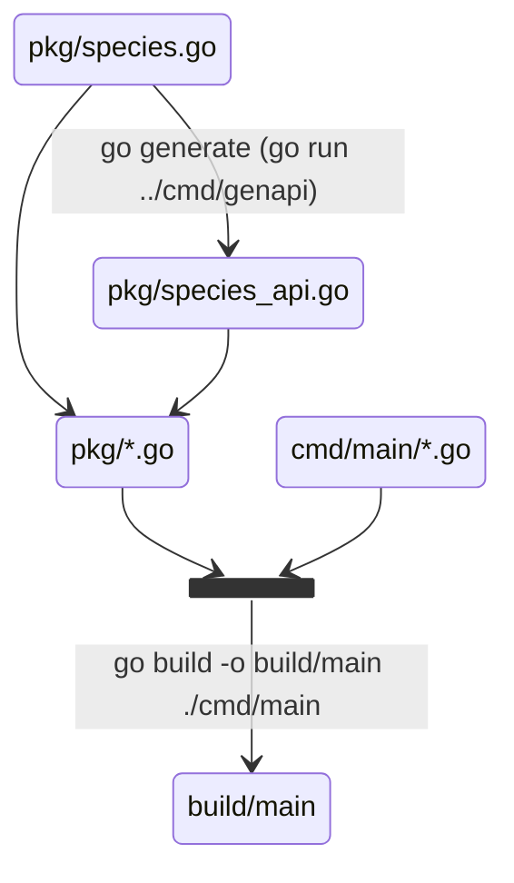

# A zero-configuration build tool
[](https://github.com/alecthomas/bit/actions/workflows/ci.yml)

Bit is a build tool that requires (close to) zero-configuration. To achieve this
it utilises a couple of different strategies:

1. Static analysis to collect build rule commands, inputs, and (optionally) outputs.
2. File-system monitoring to determine the outputs of each build command.

This approach supports two base cases for build rules that take a known set of
input globs:

1. Rules that generate a _known_ set of outputs.
2. Rules that generate a _dynamic_ set of outputs.

The latter requires file-system monitoring and as its outputs can be dynamic,
its outputs may become inputs to other rules, cannot be parallelised.

A target with a dynamic output informs Bit that it should build this target
synchronously while monitoring the file system for changes. Once the target is
built, any changes to the filesystem are fed back into the build graph as
changed inputs, potentially triggering the rebuild of other targets.

## Example

This example illustrates both base cases described above in a single build.
We'll use a syntax based on the ninja build tool, but extended to support globs
and "dynamic" outputs.

In this "go generate" generates output, but it's non-trivial for Bit to statically
determine the outputs. It's easier for the system to build dynamic rules
iteratively, monitoring the file system for changes.

```ninja
rule go-build: go build -o ${dest} ${input}

rule go-generate: go generate ${input}

build build/main: go-build cmd/main/*.go pkg/*.go
  dest = build/main

dynamic: go-generate pkg/species.go
```

Bit's static analysis knows about `go:generate` lines, but doesn't know which
outputs the command `go run ../cmd/genapi` will generate. Because `build/main` 
depends on `pkg/*.go`, which may be an output of `genapi`, Bit must run the
`go:generate` command before the `go build` command.

As a diagram this might be clearer.


```mermaid
stateDiagram-v2
  state "pkg/species.go" as sp
  state "pkg/species_api.go" as sapi
  sp --> sapi: go generate (go run ../cmd/genapi)
  state "pkg/*.go" as pkg
  state "cmd/main/*.go" as cmd
  state "build/main" as main
  sp --> pkg
  sapi --> pkg
  state main_inputs <<join>>
  pkg --> main_inputs
  cmd --> main_inputs
  main_inputs --> main: go build -o build/main ./cmd/main
```